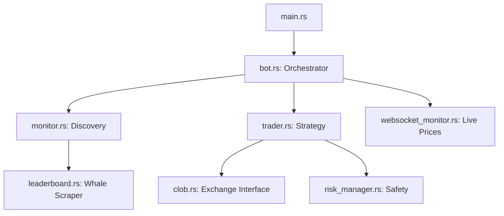

# 🚀 Polymarket Copytrade Bot (Rust Edition)

A high-performance, asynchronous trading engine designed to mirror "Whale" activity on Polymarket with precision and safety. Built for scalability, this bot leverages a modular Rust architecture to provide institutional-grade execution for retail traders.

## 🌟 Key Features

### 1. **Adaptive Scalability**
- **3-Tier Risk Management**: Automatically switches strategy based on your balance.
    - **Tier 1 (Protection)**: Tight 20% TP / 10% SL for small accounts (<$100).
    - **Tier 2 (Growth)**: Balanced 50% TP / 25% SL for medium accounts ($100-$1,000).
    - **Tier 3 (Mirror)**: Pure whale-mimicry for large accounts (>$1,000).
- **Proportional Mirroring**: Automatically scales trade sizes relative to the whale's total bankroll vs. yours.

### 2. **Professional Execution Engine**
- **Parallel Asynchronous Core**: Processes multiple whale movements simultaneously using `tokio` tasks. No queuing, no lag.
- **Auto-Execution Mode**: Dynamically chooses between `LIMIT` and `FOK` (Fill-or-Kill) orders based on balance and market urgency.
- **Precision Tick Handling**: Enforces Polymarket's 0.001 tick size to prevent validation errors.

### 3. **Smart Discovery**
- **Polywhaler Leaderboard Addon**: Optional auto-follow feature that scrapes the top 10 traders from `polywhaler.io` in real-time.
- **WebSocket Price Engine**: Reacts instantly to price changes for active positions to trigger TP/SL profit taking.

### 4. **Institutional Safety**
- **Daily Drawdown Protection**: Monitors total equity and blocks new buys if a 20% loss is hit within 24 hours.
- **Geoblock Bypass**: Built-in support for geographic tokens to ensure uninterrupted global access.
- **Graceful Shutdown**: Safe `Ctrl+C` handling to ensure all system states are logged before exit.

---

## 🏗️ Architecture



- **`src/bot.rs`**: The central brain managing state and lifecycle.
- **`src/trader.rs`**: Implements the 3-tier strategy and sizing models.
- **`src/types.rs`**: Centralized data structures for cross-module reliability.
- **`src/risk_manager.rs`**: Enforces notional caps and daily loss limits.

---

## 🛠️ Setup & Configuration

1. **Clone the repo**:
   ```bash
   git clone https://github.com/yahya-azeem/polymarket-copy-bot-rust.git
   cd polymarket-copy-bot-rust
   ```

2. **Configure `.env`**:
   Copy `.env.example` to `.env` and fill in your credentials.
   ```bash
   # Core Credentials
   PRIVATE_KEY=your_private_key
   POLYMARKET_SIGNATURE_TYPE=GNOSIS_SAFE # or EOA / PROXY
   
   # Discovery Settings
   TARGET_WALLETS=0x123...,0x456...
   USE_POLYWHALER_LEADERBOARD=true
   
   # Execution
   ORDER_TYPE=AUTO
   ```

3. **Build & Run**:
   ```bash
   cargo run --release
   ```

---

## 📊 Monitoring
The bot provides a premium, timestamped console output:
- `NEW TRADE`: Prominent alerts when a whale moves.
- `🔍 Monitoring`: Heartbeat status of active market scans.
- `✅ Copied`: Detailed fill reports and updated PnL.

---

## ⚖️ Disclaimer
Trading prediction markets involves significant risk. This software is provided "as is" without warranty. Always test with `SIMULATION_MODE=true` before deploying capital.
